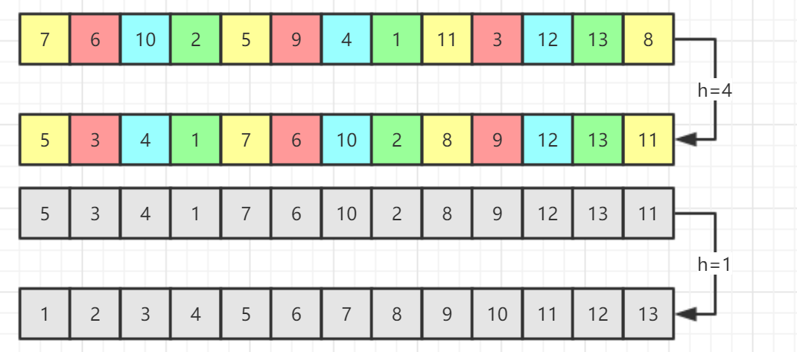

# 算法

<!-- GFM-TOC -->
* [一、排序](#排序)
    * [冒泡排序](#冒泡排序)
    * [选择排序](#选择排序)
	* [插入排序](#插入排序)
	* [希尔排序](#希尔排序)
	* [归并排序](#归并排序)
	* [快速排序](#快速排序)
	* [三项切分快速排序](#三项切分快速排序)
    
    


# 排序
计算排序算法的时间复杂度O时，主要考虑元素的**比较次数**和**交换次数**，
<br/>
比较可以通过 "<" 判断，交换则通过自己封装的swap()函数进行判断，这样比较容易观察和统计。

代码实现：
<br/>
```java
public class Sort {
    private void swap(int[] a, int i, int j) {
        a[i] ^= a[j];
        a[j] ^= a[i]; //j^i^j = i
        a[i] ^= a[j]; //i^j^i = j
    }
    ... sorting functions ...
}
```

## 冒泡排序
冒泡排序每次从左到右比较数组中相邻的元素，如果相邻元素的顺序错误，则交换相邻元素，
<br/>
每趟过后都会使得最大的元素被交换到剩余元素的末位上。

排序过程：

第1趟：遍历整个数组，每次判断相邻元素，顺序错误则交换，则第n-1位置排序完成；
<br/>
第2趟：遍历剩下0~n-2数组，每次判断相邻元素，顺序错误则交换，则第n-2,n-1位置排序完成；
<br/>
......
<br/>
第n-1趟：遍历剩下0,1位置的元素，顺序错误则交换，则数组排序完成；

代码实现：
<br/>
```java
//冒泡排序
public void bubbleSort(int[] nums) {
    int N = nums.length;
    boolean sorted = false;
    for (int i = N - 1; i > 0 && !sorted; i--) {
        sorted = true;
        for (int j = 0; j < i; j++)
            if (nums[j] > nums[j + 1]) {
                swap(nums, j, j + 1);
                sorted = false;
                System.out.println(Arrays.toString(nums));
            }
    }
}
```

时间复杂度：
- 整个排序**最好**需要 **n-1次比较** 和 **0次交换** ，时间复杂度为 **O(n)**，此时数组有序；
- 整个排序**平均**需要 **n<sup>2</sup>/4次比较** 和 **n<sup>2</sup>/4次交换** ，时间复杂度为 **O(n<sup>2</sup>)**；
- 整个排序**最坏**需要 **n<sup>2</sup>/2次比较** 和 **n<sup>2</sup>/2次交换** ，时间复杂度为 **O(n<sup>2</sup>)**，此时数组为倒序。

特点：
- 如果某一趟发现数组已经排序完成，则会及时退出避免无效操作。
- 交换过程中，值相同的元素的不会进行交换，因此**稳定**。
- 排序过程中需要辅助变量，空间复杂度为 **O(1)**。


## 选择排序
选择排序的精髓在于“选择”，每次选择数组待排元素中的最小元素，并于数组前端的元素交换。

排序过程：

第1趟：遍历整个数组，选出最小值与数组第0位置元素交换，则第0位置排序完成；
<br/>
第2趟：遍历剩下1至n-1位置的元素，选出最小值与数组第1位置元素交换，则第0,1位置排序完成；
<br/>
......
<br/>
第n-1趟：最后比较n-1至n-2位置的元素，选出最小值与第n-1位置元素交换，则数组排序完成；

代码实现：
<br/>
```java
//选择排序
public void selectSort(int[] nums) {
    int N = nums.length;
    for (int i = 0; i < N - 1; i++) {
        int minIndex = i;
        for (int j = i + 1; j < N; j++)
            if (nums[j] < nums[minIndex])
                minIndex = j;
        swap(nums, i, minIndex);
        System.out.println(Arrays.toString(nums));
    }
}
```

时间复杂度：
- 整个排序**最好**需要 **n<sup>2</sup>/2次比较** 和 **n次交换** ，时间复杂度为 **O(n<sup>2</sup>)**；
- 整个排序**平均**需要 **n<sup>2</sup>/2次比较** 和 **n次交换** ，时间复杂度为 **O(n<sup>2</sup>)**；
- 整个排序**最坏**需要 **n<sup>2</sup>/2次比较** 和 **n次交换** ，时间复杂度为 **O(n<sup>2</sup>)**。

特点：
- 无论输入数组是否有序，比较和交换次数都不变。
- 交换过程中，值相同的元素的先后位置可能改变，因此**不稳定**。
- 排序过程中需要辅助变量，空间复杂度为 **O(1)**。


## 插入排序
每一趟都取待排序元素中的第一个，插入已经排序的元素中，使得已经排序的元素依然有序。

排序过程：

第1趟：取出1位置的元素，与0位置的元素比较，顺序错误则交换，则0,1位置元素有序；
<br/>
第2趟：取出2位置的元素，依次与1,0位置的元素比较，顺序错误则交换，直到顺序正确，则0~2位置元素有序；
<br/>
......
<br/>
第n-1趟：取出n-1位置的元素，依次与n-2到0位置的元素比较顺序错误则交换，直到顺序正确，则数组排序完成；

代码实现：
<br/>
```java
//插入排序
public void insertionSort(int[] nums) {
    int N = nums.length;
    for (int i = 1; i < N; i++)
        for (int j = i; j > 0 && nums[j-1] > nums[j]; j--) {
            swap(nums, j, j - 1);
            System.out.println(Arrays.toString(nums));
        }
}
```

时间复杂度：
- 整个排序**最好**需要 **n-1次比较** 和 **0次交换** ，时间复杂度为 **O(n)**，此时数组有序；
- 整个排序**平均**需要 **n<sup>2</sup>/4次比较** 和 **n<sup>2</sup>/4次交换** ，时间复杂度为 **O(n<sup>2</sup>)**；
- 整个排序**最坏**需要 **n<sup>2</sup>/2次比较** 和 **n<sup>2</sup>/2次交换** ，时间复杂度为 **O(n<sup>2</sup>)**，此时数组为倒序。

特点：
- 如果某次比较发现元素插入位置已经正确，则结束后续比较工作。
- 取值和插入过程中，值相同的元素的先后位置不变，因此**稳定**。
- 排序过程中需要辅助变量，空间复杂度为 **O(1)**。


## 希尔排序
插入排序每次交换相邻的元素，因此每次操作只能让逆序数量减1，因此当数组规模过大时排序速度会非常慢，
<br/>
为了解决该问题，希尔排序通过交换不相邻的元素，每次使逆序数量减少大于1，来提高排序效率。
<br/>
希尔排序通过设置间隔h对数组进行排序，h = ... 40, 13, 4, 1，每次将间隔内的元素看作一个数组进行排序。

<div align="center">  </div><br/>

排序过程：

第1趟：设置间隔h=4，将间隔为4内的元素作为待排序元素，进行插入排序，
<br/>
如上图中的[7,2,4,3]元素，[6,5,1,12]元素，[10,9,11,8]元素，间隔都为4，所以当作三个数组进行插入排序；
<br/>
第2趟：设置间隔h=1，也就是对整个数组进行插入排序，则数组排序完成；

代码实现：
<br/>
```java
//希尔排序
public void shellSort(int[] nums) {
    int N = nums.length;
    int h = 1;

    while (h < N / 3)
        h = h * 3 + 1; //h=1,4,13,40, ...

    while (h >= 1) {
        for (int i = 0; i < h; i++)
            for (int j = i+h; j < N; j += h)
                for (int k = j; k-h >= 0 && nums[k-h] > nums[k]; k -= h) {
                    swap(nums, k, k-h);
                    System.out.println(Arrays.toString(nums));
                }
        h /= 3;
    }
}
```

时间复杂度：
- 整个排序**最好**时间复杂度为 **O(n)**；
- 整个排序**平均**时间复杂度为 **O(n<sup>1.3</sup>)**；
- 整个排序**最坏**时间复杂度为 **O(n<sup>2</sup>)**。

特点：
- 取间隔排序过程中，有可能改变值相同的元素的先后位置，因此**不稳定**。
- 排序过程中需要辅助变量，空间复杂度为 **O(1)**。


## 归并排序
归并排序利用了分治的思想，
<br/>
二路归并排序，将数组不断分成前后两份，直到每个子数组内元素<=2，
<br/>
然后再对每个子数组排序，并两两合并子数组再对合并的数组排序，直到原数组排序完成。

<div align="center">  </div><br/>

代码实现：
<br/>
```java
    //归并排序
    public void mergeSort(int[] nums) {
        int N = nums.length;
        mSort(nums, 0, N-1);
    }
    private void mSort(int[] nums, int l, int h) {
        if (h <= l) return;
        int m = l + (h - l) / 2;
        mSort(nums, l, m);
        mSort(nums, m+1, h);
        merge(nums, l, m, h);
    }
    private void merge(int[] nums, int l, int m, int h) {
        int[] tmp = new int[nums.length];
        System.arraycopy(nums, l, tmp, l, h - l + 1);
        
        int i = l, j = m + 1;
        for (int k = l; k <= h; k++) {
            if (i > m)
                nums[k] = tmp[j++];
            else if (j > h)
                nums[k] = tmp[i++];
            else if (tmp[i] <= tmp[j])
                nums[k] = tmp[i++];
            else
                nums[k] = tmp[j++];
            System.out.println(Arrays.toString(nums));
        }
    }
```

时间复杂度：
- 整个排序**最好**时间复杂度为 **O(nlogn)**；
- 整个排序**平均**时间复杂度为 **O(nlogn)**；
- 整个排序**最坏**时间复杂度为 **O(nlogn)**。

特点：
- 有点像选择排序，所需时间与输入数组状态无关。
- 合并过程中，保留了相同的元素的先后位置，因此**稳定**。
- 排序过程中需要复制数组，空间复杂度为 **O(n)**。


## 快速排序
快速排序与归并排序相似，也使用了分治的思想，首先将数组的第一个元素作为切分元素，
<br/>
移动数组元素，将数组分为两个子数组，左子数组的元素的值都小于切分元素，右子数组则大于，
<br/>
不断切分子数组，直到整个数组排序完成；

<div align="center">  </div><br/>

代码实现：
<br/>
```java
//快速排序
public void quickSort(int[] nums) {
    qSort(nums, 0, nums.length-1);
}
private void qSort(int[] nums, int l, int h) {
    if (h <= l) return;
    int j = qMove(nums, l, h);
    qSort(nums, l, j - 1);
    qSort(nums, j + 1, h);
}
private int qMove(int[] nums, int l, int h) {
    int tmp = nums[l];
    int i = l + 1, j = h;
    while (i < j) {
        while (nums[i] < tmp && i < h) i++;
        while (nums[j] > tmp && j > l) j--;
        if (i < j) {
            swap(nums, i, j);
            System.out.println(Arrays.toString(nums));
        }
    }
    swap(nums, l, j);
    System.out.println(Arrays.toString(nums) + j);
    return j;
}
```

时间复杂度：
- 整个排序**最好**时间复杂度为 **O(nlogn)**；
- 整个排序**平均**时间复杂度为 **O(nlogn)**；
- 整个排序**最坏**时间复杂度为 **O(n<sup>2</sup>)**。

特点：
- 交换过程中，相同的元素的先后位置关系丢失，因此**不稳定**。
- 排序过程中需要辅助变量，空间复杂度为 **O(1)**。

改进：
## 三项切分快速排序
对于内部元素大部分相同的数组，三向切分快速排序可以达到线性时间**O(n)**。
```java
//三项切分快速排序
public void threeQuickSort(int[] nums) {
    tqSort(nums, 0, nums.length-1);
}
private void tqSort(int[] nums, int l, int h) {
    if (h <= l) return;
    int tmp = nums[l];
    int lt = l, ht = h, i = lt + 1;

    while (i <= ht) {
        if (nums[i] < tmp)
            swap(nums, i++, lt++);
        else if (nums[i] > tmp)
            swap(nums, i, ht--);
        else
            i++;
        System.out.println(Arrays.toString(nums));
    }
    tqSort(nums, l, lt - 1);
    tqSort(nums, ht + 1, h);
}
```

